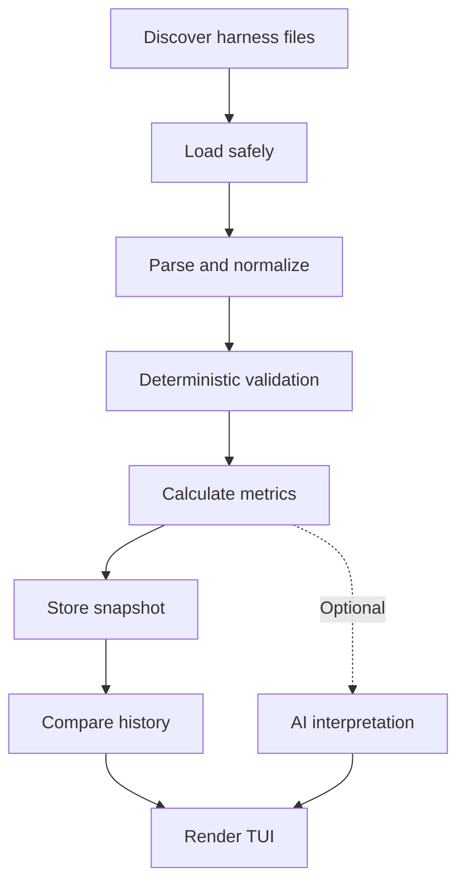

> SPDX-License-Identifier: MPL-2.0
> Copyright © 2026 Cristian Camargo Filho


# Base

> The crate boundaries in [architecture.md](architecture.md) supersede the
> early single-crate directory sketch below. The pipeline and evidence model
> remain design inputs.

```text
descobrir → carregar → normalizar → validar → medir → registrar → comparar → exibir
```

## Arquitetura proposta

```text
harness-lens/
├── src/
│   ├── main.rs
│   ├── lib.rs
│   ├── discovery/
│   │   ├── mod.rs
│   │   ├── candidates.rs
│   │   └── scope.rs
│   ├── parser/
│   │   ├── mod.rs
│   │   ├── markdown.rs
│   │   └── directives.rs
│   ├── validation/
│   │   ├── mod.rs
│   │   ├── rules.rs
│   │   ├── finding.rs
│   │   └── profiles.rs
│   ├── metrics/
│   │   ├── tokens.rs
│   │   ├── cost.rs
│   │   ├── coverage.rs
│   │   ├── alignment.rs
│   │   ├── redundancy.rs
│   │   └── conflicts.rs
│   ├── history/
│   │   ├── store.rs
│   │   ├── snapshot.rs
│   │   └── trend.rs
│   ├── tui/
│   │   ├── app.rs
│   │   ├── overview.rs
│   │   ├── findings.rs
│   │   └── trends.rs
│   ├── ai/
│   │   └── optional.rs
│   ├── config.rs
│   └── report.rs
├── tests/
└── docs/
```

## Pipeline



## Descoberta

A ferramenta deve procurar arquivos conhecidos na raiz e nos subdiretórios:

```text
AGENTS.md
CLAUDE.md
GEMINI.md
.github/copilot-instructions.md
.cursor/rules/*
```

Cada arquivo descoberto deve carregar seu escopo:

```rust
pub struct HarnessFile {
    pub path: PathBuf,
    pub kind: HarnessKind,
    pub scope: PathBuf,
    pub content: String,
}
```

Arquivos encontrados em subdiretórios podem complementar ou sobrescrever regras da raiz. Essa hierarquia precisa entrar na análise de conflitos.

## Validação

A validação deve produzir evidências, não apenas um score:

```rust
pub struct Finding {
    pub severity: Severity,
    pub rule_id: String,
    pub message: String,
    pub file: PathBuf,
    pub line: Option<usize>,
    pub evidence: Option<String>,
}
```

Exemplos:

```text
PASS  HL001  Harness file found
PASS  HL006  Valid UTF-8
PASS  HL014  Testing instructions present
WARN  HL020  Exact opposite strong instruction
WARN  HL021  Ambiguous instruction
WARN  HL027  Referenced command was not found
FAIL  HL031  Conflicting instructions
```

Categorias iniciais:

| Categoria    | Verificação                                      |
| ------------ | ------------------------------------------------ |
| Existência   | Há algum harness reconhecido                     |
| Legibilidade | UTF-8, tamanho, acesso e conteúdo                |
| Estrutura    | Títulos, seções, listas e escopo                 |
| Precisão     | Regras possuem ação e alvo identificáveis        |
| Cobertura    | Áreas previstas pelo perfil estão presentes      |
| Redundância  | Regras iguais ou quase iguais                    |
| Conflitos    | Obrigações incompatíveis                         |
| Referências  | Caminhos e comandos mencionados existem          |
| Hierarquia   | Regras locais contradizem ou sobrescrevem a raiz |
| Custo        | Tokens e custo estimado por injeção              |

## Efetividade

“Efetividade” precisa ser dividida:

* **Efetividade estrutural:** pode ser estimada estaticamente.
* **Efetividade comportamental:** exige observar execuções reais de um agente.
* **Análise por IA:** pode interpretar qualidade sem provar comportamento.

O MVP deve mostrar `Structural quality`, não alegar que comprovou a efetividade comportamental.

A validação comportamental futura pode herdar o conceito de probes do Testrium:

```text
regra declarada
    ↓
execução observada
    ↓
evidência produzida
    ↓
regra seguida ou violada
```

## Métricas sem números arbitrários

`Coverage` precisa estar ligado a um perfil explícito:

```text
Profile: coding-agent/v1

Purpose and scope       present
Build commands          present
Test commands           present
File-editing policy     present
Security constraints    missing
Dependency policy       partial
Output requirements     present
```

Então:

```text
Coverage  82% — coding-agent/v1
```

`Alignment` também precisa indicar sua referência:

```text
Policy alignment  91% — generic-coding-agent/v1
```

Sem perfil ou objetivo declarado, o HarnessLens deve exibir `Not evaluated`, não inventar precisão.

## TUI principal

```text
 HarnessLens — Overview

 Repository        harness-lens
 Harness files     2
 Primary file      AGENTS.md
 Status            Valid with warnings

 Tokens            3,842
 Tokenizer         selected-model
 Cost/injection    $0.0115
 Cost/1K runs      $11.50

 Coverage          82%  coding-agent/v1
 Alignment         91%  generic-coding-agent/v1
 Redundancy        14%
 Conflicts         2
 Findings          3 warnings · 0 errors
 Trend             Improving across 6 revisions
```

Abas:

```text
Overview | Files | Rules | Findings | Cost | History | Trends
```

## IA opcional

A IA não deve participar do score determinístico. Ela recebe o relatório estruturado e produz apenas:

* explicação das tendências;
* agrupamento semântico de regras;
* possíveis conflitos não detectados;
* simplificações sugeridas.

```bash
harness-lens scan
harness-lens tui
harness-lens compare HEAD~1
harness-lens scan --ai
```

O núcleo do projeto fica simples: descoberta inspirada no Testrium, validação determinística, histórico comparável e TUI. A IA permanece como interpretador opcional sobre resultados já calculados.
